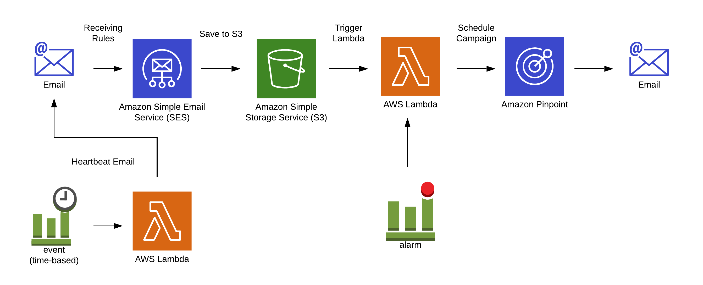

# SES to Pinpoint Segment Email Forwarder

This repo shows a simple reference architecture on how to set up inbound SES rules to forward incoming emails to different Pinpoint segments.  

## Architecture

## Setup

1. Configure SES for [outbound sending](https://docs.aws.amazon.com/ses/latest/DeveloperGuide/verify-domains.html) and [inbound receiving](https://docs.aws.amazon.com/ses/latest/DeveloperGuide/receiving-email-verification.html) by verifying the proper DNS entries.

1. Create the `default-rule-set` SES email receiving rule set.  See [docs](https://docs.aws.amazon.com/ses/latest/DeveloperGuide/receiving-email-receipt-rule-set.html).  When you create the first Rule Set, SES will name it `default-rule-set` automatically.  You can leave this rule set blank as the below steps will add Rules to it.

1. Create an Amazon Pinpoint project and note the Project Id from the Settings -> General Settings menu item.  See [docs](https://docs.aws.amazon.com/pinpoint/latest/userguide/gettingstarted-create-project.html)

1. Import data and create at least one segment.  See [docs](https://docs.aws.amazon.com/pinpoint/latest/userguide/segments-building.html).  You will need a segment for each target recipient group.

1. Deploy the [cloudformation.yaml](cloudformation.yaml) file in Amazon CloudFormation to deploy the rest of the architecture.

1. Modify the deployed Lambda to update the mapping of from name to Pinpoint segment ids.
